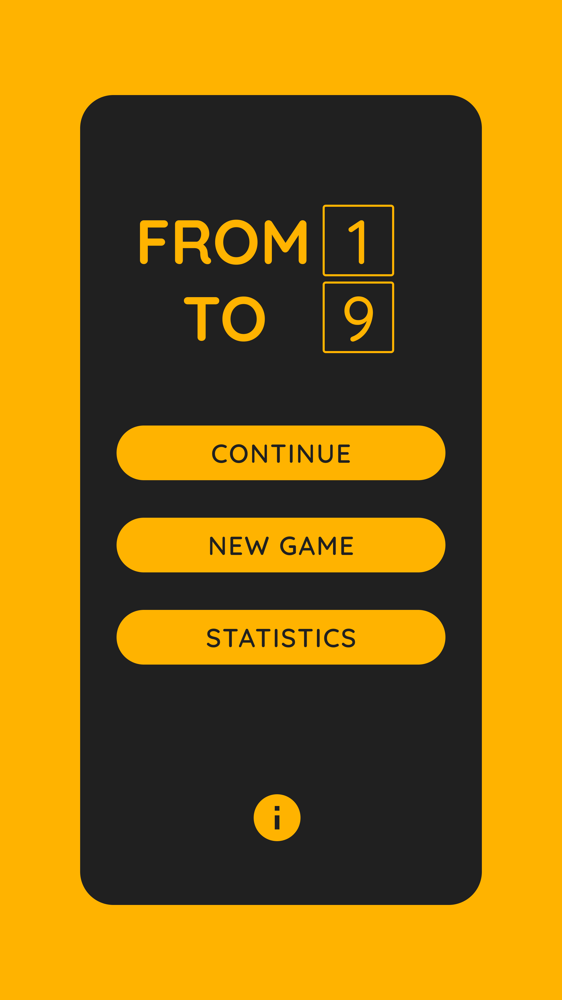
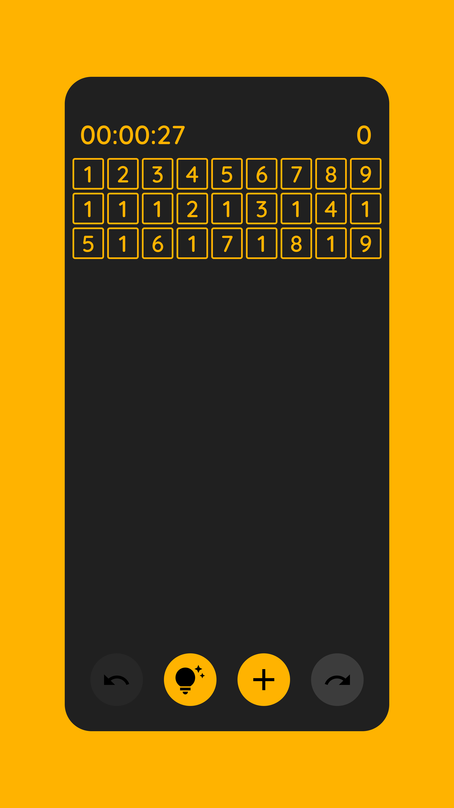
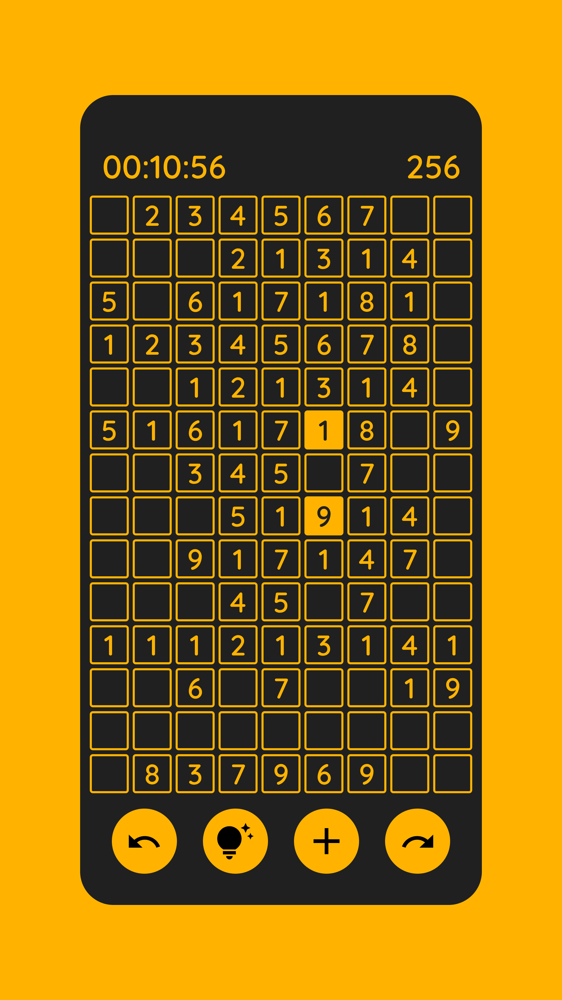
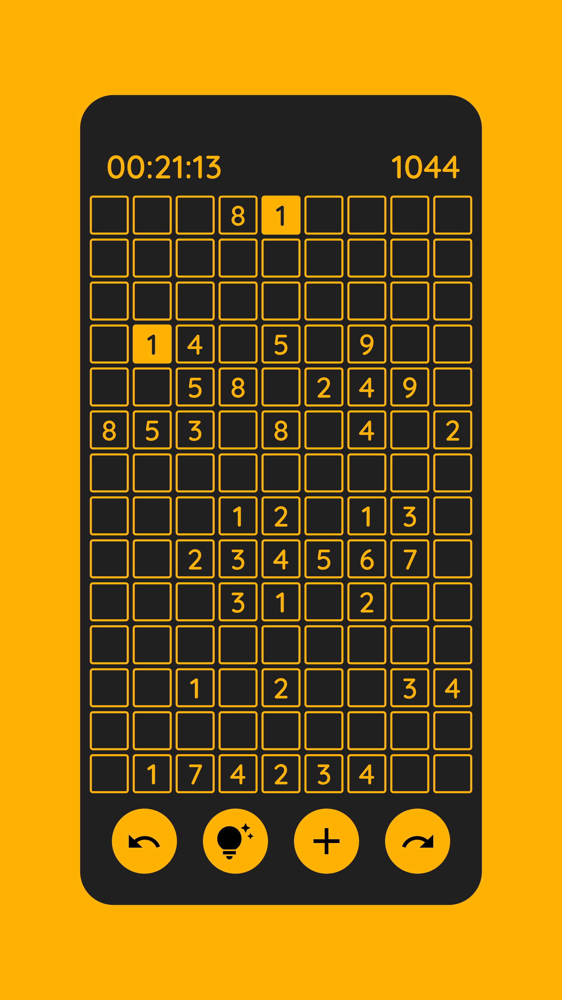

# [From 1 To 9](https://play.google.com/store/apps/details?id=com.orlovdanylo.fromonetoninegame)

"From 1 To 9" is a logic puzzle game in which the player has to eliminate all the numbers on the
playing field. They must be the same or their sum must be 10 to do this.

### Application architecture

The project is being developed by TDD principle, using MVVM and manual repository injection.

### Tech-stack:

* [Kotlin](https://kotlinlang.org)
* [XML Views](https://developer.android.com/develop/ui/views/layout/declaring-layout)
* [ROOM](https://developer.android.com/jetpack/androidx/releases/room)
* [Firebase Services](https://firebase.google.com)
* [Kotlin Coroutines](https://developer.android.com/kotlin/coroutines)

### Frames

    
    
    
    

